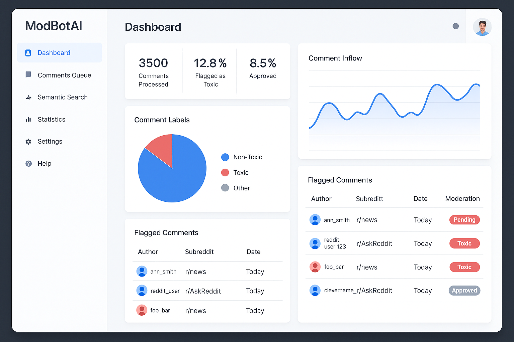
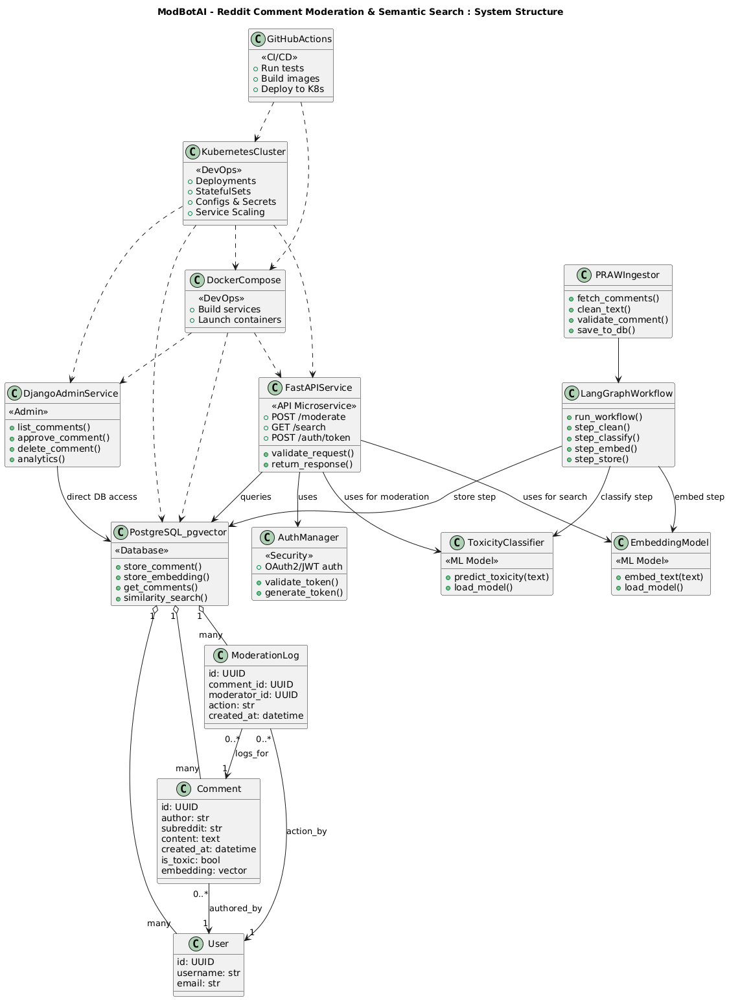

# ModBotAI – Reddit Comment Moderation & Semantic Search



## Overview

**ModBotAI** is a modular, scalable content-moderation pipeline for Reddit comments. It ingests Reddit data, classifies toxicity using fine-tuned NLP models, and enables semantic search through a vector database. The system is built around microservice principles, offering independent FastAPI and Django backends, robust ML integration, and deployment via Docker and Kubernetes.

---

## Features

- **Reddit Comment Ingestion** (PRAW-based streaming, with schema validation)
- **Toxicity Classification** (Fine-tuned RoBERTa, PyTorch)
- **Semantic Search** (Sentence Transformers + pgvector)
- **Relational & Vector Database** (PostgreSQL with normalized tables for Comments, Users, and Moderation Logs; embeddings stored via pgvector)
- **Admin Dashboard** (Django for CRUD/moderation, comment audit history)
- **FastAPI Microservice** (`/moderate`, `/search`, OAuth2-secured)
- **LangGraph Workflow Orchestration**
- **Action Auditability** (All moderation actions logged and linked to moderators)
- **Containerized & Cloud-Native** (Docker, Kubernetes)
- **Automated Testing & CI/CD** (Pytest, GitHub Actions)


---

## Architecture



**Data Flow and System Design:**
- **Ingestion Pipeline:**  
  Reddit comments are streamed via PRAW, cleaned, validated, and passed through a LangGraph workflow (clean → classify → embed → store).
- **Database Schema:**  
  - `Comment` table stores the main data (ID, author, subreddit, text, creation date, toxicity label, embedding vector).
  - `User` table tracks users (moderators and authors).
  - `ModerationLog` table records all moderation actions (who, what, when).
  - All relationships (authored by, action by, logs for) are strictly enforced (see ERD).
- **ML Models:**  
  - Fine-tuned RoBERTa for toxicity detection.
  - SentenceTransformer for dense embeddings and semantic search.
- **APIs and Services:**  
  - **FastAPI** microservice exposes `/moderate` and `/search` endpoints, secured with OAuth2/JWT. Endpoints directly reference moderation, search, and audit logic.
  - **Django Admin Dashboard** provides full CRUD, moderation actions, analytics, and a log of every moderator action for traceability.
- **Security and CI/CD:**  
  - Auth managed via OAuth2/JWT.
  - Containerization (Docker, Kubernetes) for all services.
  - CI/CD automated via GitHub Actions.

---

## Repository Structure (8 July 2025)
```bash
.
├── data_pipeline/         # Ingestion & workflow orchestration
│   ├── langgraph_flow.py
│   ├── praw_ingest.py
│   └── schemas.py         # Pydantic schemas for Comment, User, ModerationLog
├── django_app/ # Admin dashboard (moderation)
│   ├── content_review/
│   │   ├── admin.py
│   │   ├── models.py      # ORM models for Comment, User, ModerationLog
│   │   └── views.py
│   └── manage.py
├── docker/ # Dockerfiles for all services
│ ├── Dockerfile.django
│ ├── Dockerfile.fastapi
│ └── Dockerfile.postgres
├── docs/ # Documentation, project plan, mockups
│ ├── concept_mockup.png
│ └── Project Plan_ ModBotAI – Reddit Comment Moderation & Semantic Search.pdf
├── fastapi_app/ # Public API service
│ ├── auth.py
│ ├── endpoints.py
│ ├── main.py
│ └── schemas.py
├── k8s/ # Kubernetes manifests
│ ├── django-deploy.yaml
│ ├── fastapi-deploy.yaml
│ ├── pgvector-initdb.sql
│ └── postgres-statefulset.yaml
├── models/ # ML model code (training & inference)
│ ├── fine_tune_roberta.ipynb
│ └── train.py
├── tests/ # Unit and integration tests
│ ├── test_django.py
│ └── test_fastapi.py
└── README.md
```

---

## Database Schema (Entity-Relationship Diagram)

The ModBotAI backend uses a normalized relational schema for scalable moderation and auditing:

- **Comment:** Stores all ingested Reddit comments (with toxicity, embedding vector).
- **User:** Stores both comment authors and moderators.
- **ModerationLog:** Every moderation action (approve/delete) is logged with moderator ID and timestamp, linked to the relevant comment and user.


All endpoints and admin actions map directly to these data entities, ensuring full traceability and auditability of moderation activity.

---

## Getting Started

### Prerequisites

- Python 3.10+
- Docker & Docker Compose
- PostgreSQL 15+ (with pgvector extension)
- Kubernetes (optional for production)
- [PRAW](https://praw.readthedocs.io/), [FastAPI](https://fastapi.tiangolo.com/), [Django](https://www.djangoproject.com/), [PyTorch](https://pytorch.org/), [Hugging Face Transformers](https://huggingface.co/docs/transformers), [LangGraph](https://www.langchain.com/langgraph), [SentenceTransformers](https://www.sbert.net/)

### 1. Clone the Repository

```bash
git clone https://github.com/your-org/modbotai.git
cd modbotai
```

### 2. Set Up Environment
Configure environment variables for database, Reddit API, and secrets in .env files (not included for security).

### 3. Build and Run with Docker
```bash
# Build Docker images
docker build -f docker/Dockerfile.fastapi -t modbotai-fastapi .
docker build -f docker/Dockerfile.django -t modbotai-django .
```

### Launch stack (see docker-compose.yml or use kubectl for K8s)
Example: docker-compose up --build

Or deploy on Kubernetes using the manifests in k8s/.

### 4. Run Database Migrations
```bash
cd django_app
python manage.py migrate
```

### 5. Start Services
- FastAPI: Serves API at /moderate, /search
- Django: Admin interface at /admin
- Data Pipeline: Run data_pipeline/praw_ingest.py to start ingestion

### API Endpoints

- `POST /moderate` – Classifies and stores a Reddit comment; logs moderation outcome.
- `GET /search` – Semantic search on stored comments (vector similarity).
- `POST /auth/token` – OAuth2/JWT authentication.
- (Admin) All moderator actions (approve, delete) are logged and auditable.

See FastAPI docs for request/response schemas; see Django admin for action logs.


### Testing
Run tests using pytest:
```bash
pytest tests/
```
Tests include:
- FastAPI endpoint coverage (TestClient)
- Django admin/model actions
- Integration: E2E ingestion → classification → search

CI/CD via GitHub Actions runs on every push (lint, test, build, deploy).

### Deployment
- Docker: Each microservice has its own Dockerfile
- Kubernetes: Deployments/StatefulSets in k8s/
- CI/CD: Automated via GitHub Actions

### Contributing
Pull requests welcome! Please see docs for architecture and contribution guidelines.

### References
- Project Plan
- LangGraph Documentation
- FastAPI Docs
- pgvector Documentation
- Sentence Transformers
- PRAW (Reddit API)

## License

This project is licensed under the [MIT License](./LICENSE).

### ModBotAI — Scalable, modular content moderation for the modern web.
For questions or issues, please open a GitHub Issue or contact the maintainers.

---

Built with microservice best practices, high performance ML, and production-grade Python.
